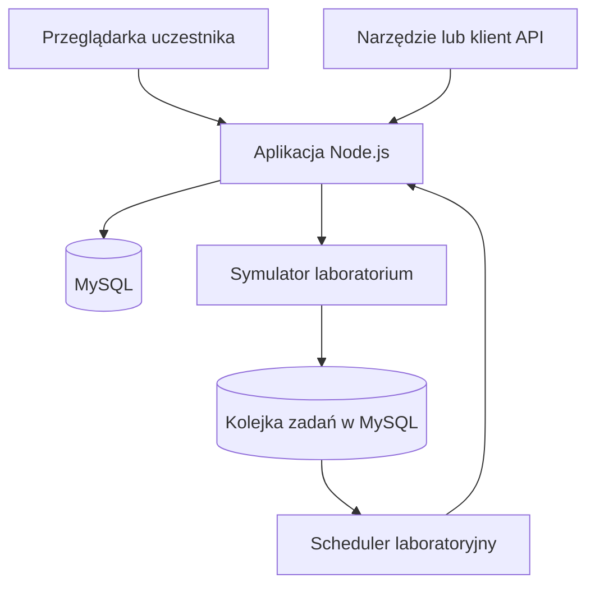

# Klinika Debug — architektura techniczna

**Wersja:** 1.0  
**Status:** propozycja do akceptacji  
**Dokumenty bazowe:** `docs/dokumentacja-produktowa.md`, `docs/specyfikacja-mvp.md`

## 1. Cel dokumentu

Dokument opisuje architekturę techniczną MVP Kliniki Debug oraz decyzje potrzebne do rozpoczęcia implementacji. Rozwiązanie jest projektowane dla maksymalnie 15 uczestników pracujących równocześnie i automatycznego wdrażania z repozytorium GitHub na zarządzany hosting Node.js w Hostingerze.

Priorytetami są:

- pełny proces od rejestracji pacjenta do wyniku badania;
- rozbudowane i łatwe do testowania REST API;
- przewidywalne działanie scenariuszy laboratoryjnych i pakietów błędów;
- izolacja danych uczestników;
- szybki reset środowiska;
- proste wdrożenie i utrzymanie przed warsztatem;
- polski interfejs oraz polskie opisy w dokumentacji OpenAPI.

## 2. Założenia środowiska

Architektura zakłada:

- wdrożenie jako jedna serwerowa aplikacja Node.js na planie Hostinger obsługującym aplikacje Node.js;
- połączenie prywatnego repozytorium GitHub z Hostingerem;
- automatyczny build i deploy po zmianie wskazanej gałęzi;
- domenę `klinikadebug.rwasik.pl`;
- bazę MySQL utworzoną w hPanelu;
- brak wymaganego VPS-a, Dockera, Redisa i osobnego serwera aplikacyjnego;
- jedno środowisko produkcyjno-warsztatowe;
- możliwość uruchomienia całego systemu lokalnie przy użyciu Dockera wyłącznie dla bazy MySQL.

Jeżeli docelowy plan Hostingera okaże się VPS-em zamiast zarządzanego hostingu Node.js, kod aplikacji pozostaje bez zmian. Zmianie ulega jedynie konfiguracja wdrożenia.

## 3. Wybrany stos technologiczny

| Obszar | Technologia | Uzasadnienie |
|---|---|---|
| Język | TypeScript | Jeden język dla UI, API, symulatora i narzędzi pomocniczych |
| Frontend | React + Vite | Szybki interfejs SPA i prosty build statycznych zasobów |
| Backend | NestJS | Modułowa struktura, walidacja, filtry błędów i dobra obsługa OpenAPI |
| Adapter HTTP | Fastify | Niski narzut i wystarczająca wydajność dla ćwiczeń API |
| Dokumentacja API | `@nestjs/swagger` | Automatyczne generowanie OpenAPI oraz interaktywnej strony `/api/docs` |
| Baza danych | MySQL 8 | Natywna baza dostępna na zarządzanym hostingu Hostinger |
| ORM i migracje | Prisma z adapterem `@prisma/adapter-mariadb` | Czytelny model danych, migracje i seedowanie bez natywnego silnika Rust w runtime |
| Testy backendu | Jest + Supertest | Testy jednostkowe i integracyjne reguł oraz endpointów |
| Testy frontendu | Vitest + Testing Library | Testy komponentów i najważniejszych zachowań UI |
| Testy E2E | Playwright — opcjonalnie | Przydatny do demonstracji, ale nie jest warunkiem MVP |
| Testy wydajności | k6 — opcjonalnie | Przydatny do ćwiczeń, ale nie jest obowiązkową bramką CI |
| Monorepo | npm workspaces | Brak dodatkowego menedżera pakietów i prostszy build w Hostingerze |

Pierwotnie rozważane FastAPI, PostgreSQL i Redis nie są wybierane w MVP. Automatyczne wdrożenie Hostingera z repozytorium jest przygotowane przede wszystkim dla aplikacji Node.js, a MySQL jest natywną bazą na zarządzanym hostingu. Redis i PostgreSQL wymagałyby VPS-a albo usług zewnętrznych.

## 4. Topologia systemu



Frontend, API, panel techniczny, symulator laboratorium i scheduler są modułami jednego procesu Node.js. Komunikacja z symulatorem oraz callback z wynikiem odbywają się przez HTTP, mimo że moduły są wdrożone razem.

Taki układ upraszcza deployment, ale zachowuje granice integracji potrzebne do testowania requestów, odpowiedzi, timeoutów, retry, idempotencji i webhooków.

## 5. Struktura repozytorium

```text
klinika-debug/
├── apps/
│   ├── api/                  # NestJS: API, panel admina, symulator i scheduler
│   └── web/                  # React + Vite: interfejs użytkownika
├── packages/
│   ├── api-contracts/        # Współdzielone typy techniczne i schematy
│   ├── domain/               # Reguły i typy domenowe bez zależności od HTTP
│   └── test-data/            # Generatory wyłącznie syntetycznych danych
├── prisma/
│   ├── schema.prisma
│   ├── migrations/
│   └── seed.ts
├── docs/
│   ├── dokumentacja-produktowa.md
│   ├── specyfikacja-mvp.md
│   └── architektura-techniczna.md
├── tests/
│   ├── integration/
│   ├── e2e/                  # Opcjonalne testy Playwright
│   └── performance/          # Opcjonalne skrypty k6
├── package.json
├── package-lock.json
└── AGENTS.md
```

Build frontendu tworzy zasoby statyczne, które NestJS udostępnia razem z API. Dzięki temu Hostinger uruchamia jeden proces i jedna domena obsługuje UI, API oraz dokumentację.

## 6. Podział backendu na moduły

| Moduł | Odpowiedzialność |
|---|---|
| `auth` | Logowanie, sesje, wylogowanie i kontrola bezczynności |
| `workspaces` | Izolacja placówek i kontekst bieżącego workspace’u |
| `patients` | Pacjenci, walidacje, import i eksport |
| `tests-catalog` | Katalog badań i wymaganych materiałów |
| `orders` | Zlecenia, statusy, próbki i reguły przejść |
| `lab-client` | Wysyłanie zleceń, idempotencja i retry |
| `lab-simulator` | Przyjmowanie zleceń i tworzenie zaplanowanych odpowiedzi |
| `lab-callbacks` | Uwierzytelnienie i przetwarzanie webhooków |
| `lab-jobs` | Trwała kolejka oraz scheduler zadań laboratoryjnych |
| `notifications` | Powiadomienia wewnątrz aplikacji |
| `history` | Historia biznesowa zleceń |
| `logs` | Logi techniczne, maskowanie i wyszukiwanie po `correlationId` |
| `environment` | Aktywny tryb laboratorium i globalny pakiet błędów |
| `admin` | Oddzielne uwierzytelnienie i operacje techniczne |
| `data-management` | Presety, seedowanie i reset danych |

Reguły domenowe nie powinny znajdować się w kontrolerach HTTP ani komponentach React. Są implementowane w warstwie domenowej i wywoływane przez serwisy aplikacyjne.

## 7. Model danych

Główne tabele:

| Tabela | Najważniejsze dane |
|---|---|
| `workspaces` | Placówki uczestników |
| `users` | Konta `STAFF`, hash hasła, aktywność i `workspaceId` |
| `user_sessions` | Hash tokenu, czas ostatniej aktywności, wygaśnięcie i unieważnienie |
| `patients` | Dane syntetycznego pacjenta oraz identyfikacja |
| `guardians` | Dane opiekuna pacjenta niepełnoletniego |
| `medical_tests` | Wspólny katalog badań |
| `test_parameters` | Parametry zwracane dla badania |
| `orders` | Zlecenie, status, priorytet i identyfikatory integracji |
| `order_tests` | Badania przypisane do zlecenia |
| `samples` | Wymagany materiał, kod kreskowy i status próbki |
| `results` | Wyniki parametrów i zakresy referencyjne |
| `order_history` | Historia zdarzeń biznesowych |
| `notifications` | Powiadomienia użytkownika |
| `idempotency_keys` | Klucz, hash requestu i zapisana odpowiedź |
| `processed_lab_events` | Odebrane `eventId` webhooków |
| `lab_jobs` | Trwałe zadania symulatora i czas wykonania |
| `environment_config` | Globalna konfiguracja środowiska |
| `admin_audit_log` | Historia zmian wykonanych w `/admin` |
| `technical_logs` | Ustrukturyzowane zdarzenia techniczne bez jawnych danych pacjenta |

### 7.1. Izolacja workspace’ów

- Każda tabela zawierająca dane uczestnika ma obowiązkowe `workspaceId`.
- `workspaceId` jest pobierane z aktywnej sesji, a nie z payloadu użytkownika.
- Serwisy i repozytoria danych wymagają kontekstu workspace’u.
- Unikalność PESEL-u, dokumentu i kodu kreskowego jest liczona w obrębie workspace’u.
- Endpointy nie ujawniają, czy rekord o podanym identyfikatorze istnieje w innym workspace’ie.
- Eksport i reset uczestnika zawsze zawierają jawny warunek `workspaceId`.

Izolacja workspace’ów musi mieć obowiązkowe testy integracyjne. Jest to bramka jakości, a nie opcjonalne zabezpieczenie.

## 8. Uwierzytelnienie

### 8.1. Konta uczestników

- `POST /api/v1/auth/login` przyjmuje login i hasło.
- Hasła są przechowywane jako hash Argon2id.
- Po zalogowaniu powstaje losowy token sesji; w bazie przechowywany jest wyłącznie jego hash.
- UI przesyła token jako `Authorization: Bearer <token>`.
- Token jest przechowywany w `sessionStorage`, dlatego zamknięcie karty kończy dostęp w przeglądarce.
- Każda autoryzowana operacja sprawdza 60 minut bezczynności i aktualizuje `lastActivityAt`.
- `POST /api/v1/auth/logout` unieważnia sesję.
- Nie ma samodzielnej rejestracji ani resetowania hasła.

Ten sam mechanizm pozwala uczestnikom łatwo pobrać token i testować API w Swaggerze, Postmanie, Bruno albo wygenerowanym skrypcie.

### 8.2. Panel techniczny

- `/admin` nie korzysta z kont `STAFF`.
- Dostęp wymaga osobnego sekretu ustawionego jako zmienna środowiskowa.
- Po poprawnym logowaniu powstaje krótka sesja techniczna w ciasteczku `HttpOnly`, `Secure` i `SameSite=Strict`.
- Endpointy panelu znajdują się pod `/internal/admin` i nie są publikowane w dokumentacji OpenAPI dla uczestników.
- Każda zmiana konfiguracji i reset są zapisywane w `admin_audit_log`.
- Sekretu panelu nie wolno zapisywać w repozytorium ani logach.

## 9. API i obsługa błędów

- Publiczne API jest dostępne pod `/api/v1`.
- Dokumentacja OpenAPI jest dostępna pod `/api/docs`.
- Opisy endpointów, pól i przykładów w OpenAPI są po polsku.
- Nazwy endpointów, właściwości JSON, enumów i kodów błędów pozostają po angielsku.
- Każdy request otrzymuje `correlationId`; klient może również przekazać własny poprawny identyfikator.
- `correlationId` jest zwracany w nagłówku i treści błędu.
- Listy używają spójnych parametrów `page`, `pageSize`, `sort`, `order` i filtrów domenowych.
- Daty są przesyłane jako ISO 8601 w UTC, a UI prezentuje je w polskiej strefie czasowej.

Jednolity format błędu:

```json
{
  "error": {
    "code": "PATIENT_VALIDATION_ERROR",
    "message": "Nie udało się zapisać pacjenta.",
    "correlationId": "01J...",
    "fieldErrors": [
      {
        "field": "pesel",
        "code": "INVALID_CHECKSUM",
        "message": "Numer PESEL ma nieprawidłową sumę kontrolną."
      }
    ]
  }
}
```

## 10. Symulator laboratorium

Symulator jest logicznie zewnętrznym systemem, ale działa w tym samym wdrożeniu. Ma oddzielne endpointy i uwierzytelnienie techniczne.

Przebieg:

1. Klinika wysyła HTTP `POST /api/v1/lab-simulator/orders`.
2. Symulator waliduje podpis techniczny i `Idempotency-Key`.
3. Symulator zwraca `202 Accepted` albo zaprogramowany błąd synchroniczny.
4. Dla przyjętego zlecenia zapisuje zadanie w `lab_jobs` z polem `executeAt`.
5. Scheduler cyklicznie pobiera zadania, których termin minął.
6. Scheduler wysyła HTTP `POST /api/v1/integrations/lab/results`.
7. Klinika weryfikuje podpis webhooka i unikalność `eventId`, zapisuje wyniki i zmienia status zlecenia.

Adres bazowy wywołań jest konfigurowany przez `APP_BASE_URL`. W środowisku lokalnym i produkcyjnym komunikacja odbywa się przez HTTP, dzięki czemu cały przepływ pozostaje widoczny w logach i możliwy do testowania na poziomie API.

### 10.1. Trwała kolejka bez Redisa

Tabela `lab_jobs` zawiera między innymi:

- `id`;
- `workspaceId`;
- `orderId`;
- `scenario`;
- `payload`;
- `executeAt`;
- `status`;
- `attempts`;
- `lockedAt`;
- `lastError`.

Scheduler uruchamia się wraz z aplikacją i sprawdza kolejkę co kilka sekund. Zadanie jest atomowo rezerwowane przed wykonaniem. Restart aplikacji nie usuwa zadań: po ponownym uruchomieniu scheduler przejmuje rekordy oczekujące oraz zwalnia blokady starsze niż ustalony limit.

Nie należy używać wyłącznie timerów przechowywanych w pamięci procesu, ponieważ zostałyby utracone podczas deployu albo restartu.

## 11. Scenariusze i celowe błędy

System rozróżnia dwa mechanizmy:

1. **Tryb laboratorium** — poprawny scenariusz biznesowy, np. sukces, wynik częściowy, odrzucenie lub brak callbacka.
2. **Pakiet błędów** — celowo nieprawidłowe zachowanie aplikacji używane podczas ćwiczeń.

`environment_config` przechowuje jeden globalny stan:

- aktywny tryb laboratorium;
- opóźnienie odpowiedzi;
- aktywny pakiet błędów;
- wersję konfiguracji;
- czas i autora ostatniej zmiany.

Zmiana działa na nowe operacje wykonywane po jej zapisaniu. Zlecenie już przyjęte przez laboratorium zachowuje scenariusz zapisany w swoim zadaniu, co zapewnia deterministyczność.

Pakiety MVP:

- `CLEAN`;
- `PATIENT_DATA`;
- `ORDER_FLOW`;
- `LAB_INTEGRATION`;
- `LOGS`;
- `PERFORMANCE`.

Każdy celowy defekt jest zaimplementowany jako jawna strategia albo przełącznik w wyznaczonej warstwie. Kod pakietów nie może być rozproszony po aplikacji bez wspólnego mechanizmu sterującego.

## 12. Panel `/admin`

Panel techniczny umożliwia:

- sprawdzenie aktywnego trybu i pakietu;
- ustawienie trybu laboratorium;
- ustawienie opóźnienia: 10, 60, 300 sekund albo brak callbacka;
- aktywację jednego pakietu błędów;
- powrót do `CLEAN`;
- załadowanie presetu `STANDARD` albo `LARGE`;
- reset wszystkich workspace’ów;
- reset jednego workspace’u w sytuacji awaryjnej;
- podgląd technicznych zadań laboratoryjnych i ich statusów;
- podgląd dziennika zmian konfiguracji.

Panel nie jest dostępny w nawigacji uczestnika. API panelu nie jest częścią publicznego kontraktu produktu.

Operacje resetu wymagają dodatkowego potwierdzenia w UI. Reset wszystkich workspace’ów nie może zostać uruchomiony przypadkowym pojedynczym kliknięciem.

## 13. Dane początkowe i reset

Seed tworzy:

- 15 kont uczestników i jedno konto zapasowe;
- 16 osobnych workspace’ów;
- wspólny katalog pięciu badań;
- konfigurację środowiska `CLEAN`;
- syntetyczne dane zgodne z wybranym presetem.

Presety:

| Preset | Pacjenci na workspace | Zlecenia na workspace | Zastosowanie |
|---|---:|---:|---|
| `STANDARD` | 100 | 40 | Zwykła praca warsztatowa |
| `LARGE` | 5000 | 1000 | Wyszukiwanie, eksport i wydajność |

Generator danych musi tworzyć poprawne i fikcyjne numery PESEL, zachowywać spójność daty urodzenia i płci oraz nie korzystać z list prawdziwych osób.

Reset usuwa dane transakcyjne, odtwarza preset i ustawia środowisko w trybie `CLEAN`. Operacja jest transakcyjna tam, gdzie pozwala na to MySQL, oraz zapisuje wynik poszczególnych etapów. Nie jest wykonywana automatycznie podczas deployu.

## 14. Logi i obserwowalność

Aplikacja zapisuje logi w formacie JSON do standardowego wyjścia, aby były dostępne w logach runtime Hostingera. Wybrane zdarzenia są również zapisywane w `technical_logs`, aby uczestnicy mogli analizować je w interfejsie albo przez API.

Każdy wpis może zawierać:

- czas;
- poziom;
- moduł;
- typ zdarzenia;
- `correlationId`;
- `orderId`;
- `externalOrderId`;
- kod odpowiedzi;
- czas trwania;
- numer próby retry.

Logi nie przechowują pełnego PESEL-u, numeru dokumentu, adresu, telefonu, e-maila ani pełnych payloadów pacjenta. Maskowanie odbywa się przed przekazaniem danych do loggera.

## 15. Frontend

- Cały interfejs jest po polsku.
- Wartości enum są mapowane na polskie etykiety w jednym współdzielonym słowniku UI.
- UI nie interpretuje wyników medycznych i nie generuje zaleceń.
- Listy obsługują paginację, sortowanie i filtry po stronie API.
- Status oczekującego zlecenia jest odświeżany co 10 sekund.
- Błędy API są prezentowane po polsku, a przy problemach technicznych pokazują `correlationId`.
- Widok `/docs` prezentuje zaakceptowaną dokumentację produktową.
- Nie istnieje przełącznik na język angielski.

## 16. Testy i bramki jakości

Obowiązkowe dla MVP:

- formatowanie i lint;
- sprawdzenie typów TypeScript;
- testy jednostkowe reguł domenowych;
- testy integracyjne API z MySQL;
- testy izolacji workspace’ów;
- test migracji bazy na pustej bazie;
- build frontendu i backendu;
- skan zależności pod kątem znanych podatności.

Opcjonalne:

- testy E2E w Playwright;
- testy wydajnościowe w k6;
- uruchamianie testów opcjonalnych w CI.

Celowe błędy warsztatowe nie mogą powodować nieprzewidywalnego niepowodzenia obowiązkowych bramek. Testy poprawnej wersji uruchamiają środowisko z pakietem `CLEAN`.

## 17. Deployment w Hostingerze

### 17.1. Przepływ

1. Hostinger jest połączony z prywatnym repozytorium `Radek959/klinika-debug`.
2. Gałęzią wdrażaną na środowisko warsztatowe jest `main`.
3. Praca odbywa się na krótkich gałęziach i trafia do `main` przez pull request.
4. Merge do `main` uruchamia build i automatyczny deploy.
5. Migracje Prisma są wykonywane przed uruchomieniem nowej wersji aplikacji.
6. Seed i reset danych są uruchamiane wyłącznie świadomie, nigdy przy każdym deployu.

### 17.2. Komendy

Docelowe skrypty w głównym `package.json`:

```json
{
  "scripts": {
    "build": "npm run build --workspace=@klinika/api-contracts && npm run build --workspace=@klinika/domain && npm run build --workspace=@klinika/web && npm run build --workspace=@klinika/api",
    "build:hostinger": "npm run db:generate && npm run build && npm run db:migrate",
    "build:hostinger:seed": "npm run build:hostinger && npm run db:seed",
    "start": "npm run start:prod --workspace=@klinika/api",
    "db:migrate": "prisma migrate deploy",
    "db:seed": "prisma db seed",
    "check": "npm run lint && npm run typecheck && npm test && npm run build"
  }
}
```

Konfiguracja w Hostingerze dla frameworka `Other`:

- Build command pierwszego wdrożenia: `npm run build:hostinger:seed`;
- Build command kolejnych wdrożeń: `npm run build:hostinger`;
- Package manager: `npm`;
- Output directory: `./`;
- Entry file: `apps/api/dist/main.js`.

Hostinger w trybie `Other` nie używa osobnego pola Start command. Seed jest uruchamiany tylko świadomie podczas pierwszego wdrożenia przez `build:hostinger:seed`; zwykłe wdrożenia wykonują migracje przez `build:hostinger`, ale nie seedują danych.

### 17.3. Zmienne środowiskowe

Minimalny zestaw:

- `NODE_ENV`;
- `PORT` — wartość dostarczana przez hosting;
- `APP_BASE_URL=https://klinikadebug.rwasik.pl`;
- `DATABASE_URL`;
- `SESSION_TOKEN_PEPPER`;
- `ADMIN_PASSWORD_HASH`;
- `ADMIN_SESSION_SECRET`;
- `LAB_OUTBOUND_SECRET`;
- `LAB_WEBHOOK_SECRET`;
- `LOG_LEVEL`.

Wartości produkcyjne są ustawiane w hPanelu. Plik `.env` nie trafia do repozytorium.

### 17.4. Kontrola wdrożenia

Po deployu wykonywany jest test dymny:

- `GET /health/live` potwierdza działanie procesu;
- `GET /health/ready` potwierdza połączenie z bazą i gotowość aplikacji;
- `/login` zwraca polski interfejs;
- `/api/docs` zwraca dokumentację OpenAPI;
- logowanie kontem technicznym testowym działa;
- środowisko nadal ma oczekiwany pakiet błędów i preset danych.

Deploy nie może automatycznie zmieniać aktywnego pakietu błędów ani resetować danych warsztatowych.

### 17.5. Prisma w runtime Hostingera

Prisma Client działa w trybie `engineType = "client"` i korzysta z oficjalnego adaptera `@prisma/adapter-mariadb`. Aplikacja parsuje istniejące `DATABASE_URL` i tworzy jedną pulę połączeń z limitem `connectionLimit: 2`, odpowiednim dla hostingu współdzielonego. Migracje nadal są wykonywane przez `prisma migrate deploy` podczas builda Hostinger.

## 18. Lokalne uruchomienie

Lokalnie wymagane są:

- Node.js 22 LTS;
- npm;
- Docker z MySQL albo lokalny MySQL 8.

Repozytorium będzie zawierało `docker-compose.yml` uruchamiający wyłącznie zależności lokalne, przede wszystkim MySQL. Sama aplikacja może być uruchamiana przez npm z hot reloadem, aby zachować szybki cykl pracy w Codexie i lokalnym IDE.

## 19. Decyzje i kompromisy

| Decyzja | Korzyść | Koszt lub ograniczenie |
|---|---|---|
| Jeden proces Node.js | Prosty deploy z repozytorium | Mniejsza niezależność skalowania modułów |
| NestJS + React | Bogate API i oddzielony interfejs | Więcej struktury niż w jednej aplikacji Next.js |
| MySQL zamiast PostgreSQL | Natywna integracja z hostingiem | Rezygnacja z części funkcji PostgreSQL |
| Kolejka w MySQL | Brak Redisa i odporność na restart | Scheduler wymaga kontroli blokad i idempotencji |
| Symulator w tym samym wdrożeniu | Proste utrzymanie | Nie odwzorowuje awarii osobnej infrastruktury |
| Sesje przechowywane w bazie | Prawidłowa bezczynność i możliwość unieważnienia | Odczyt sesji przy requestach |
| Playwright i k6 opcjonalne | MVP nie jest blokowane przez dodatkowe zestawy testów | Mniejszy zakres automatycznej walidacji UI i wydajności |

## 20. Kryteria gotowości architektury do implementacji

Implementację szkieletu można rozpocząć po zaakceptowaniu:

- stosu TypeScript + React + NestJS + MySQL;
- pojedynczego procesu Node.js w Hostingerze;
- kolejki laboratoryjnej zapisanej w MySQL;
- modelu sesji użytkownika i osobnego dostępu do `/admin`;
- struktury monorepo;
- przepływu wdrożenia z `main`.

Pierwszy etap implementacji powinien dostarczyć działający pion techniczny: polską stronę logowania, endpoint logowania, połączenie z MySQL, migrację, jedno konto syntetyczne, `/health` oraz `/api/docs`.
