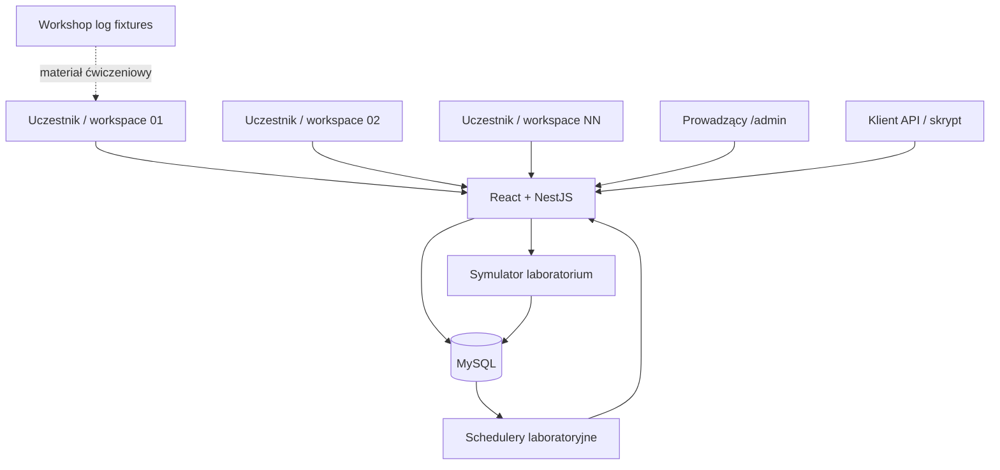

# Klinika Debug — architektura techniczna Workshop MVP

**Wersja:** 2.0  
**Status:** zaakceptowana, wdrażana  
**Dokumenty bazowe:** `docs/dokumentacja-produktowa.md`, `docs/specyfikacja-mvp.md`, `docs/warsztat/przebieg-szkolenia.md`, `docs/implementation/workshop-mvp.md`

## 1. Cel dokumentu

Dokument opisuje kierunek techniczny Kliniki Debug jako środowiska do szkolenia „Tester z AI”.

Architektura ma obsłużyć maksymalnie kilkanaście–kilkadziesiąt równoległych kont warsztatowych, realistyczny proces biznesowy i ćwiczenia z UI, API, `correlationId`, retry oraz logami.

Klinika Debug nie jest projektowana jako pełny system medyczny ani skalowalny SaaS. Preferujemy proste rozwiązania, które są stabilne, łatwe do testowania i łatwe do zresetowania przed szkoleniem.

### Priorytety

1. stabilna główna ścieżka pacjent → zlecenie → próbki → laboratorium → wynik;
2. pełna izolacja danych uczestników;
3. realistyczne REST API i OpenAPI;
4. deterministyczne scenariusze laboratorium;
5. 2–3 deterministyczne kontrolowane defekty;
6. prosty panel prowadzącego;
7. szybki provisioning i reset środowiska;
8. realistyczne syntetyczne materiały logowe;
9. proste wdrożenie i utrzymanie.

## 2. Hierarchia decyzji technicznych

Przed dodaniem funkcji należy sprawdzić:

1. czy funkcja jest potrzebna w `docs/warsztat/przebieg-szkolenia.md`;
2. czy należy do `docs/implementation/workshop-mvp.md`;
3. czy zachowanie uczestnika jest opisane w `docs/dokumentacja-produktowa.md`;
4. czy można ją zaimplementować bez budowania ogólnego frameworka.

Starsza dokumentacja implementacyjna nie może samodzielnie rozszerzać Workshop MVP.

## 3. Środowisko i deployment

Architektura zakłada:

- jedno środowisko warsztatowe pod `klinikadebug.rwasik.pl`;
- jedną aplikację Node.js wdrażaną z GitHub na Hostinger;
- MySQL jako trwałą bazę;
- brak obowiązkowego Redisa, brokera wiadomości i dodatkowych usług;
- brak osobnego backendu dla panelu prowadzącego;
- frontend, API, panel prowadzącego, symulator laboratorium i schedulery w jednym deploymentcie;
- lokalny MySQL/Docker wyłącznie jako pomoc w developmentcie i testach.

Nie optymalizujemy architektury pod skalę produkcyjnego systemu medycznego.

## 4. Stos technologiczny

| Obszar | Technologia | Kierunek |
|---|---|---|
| Język | TypeScript | jeden język dla aplikacji |
| Frontend | React + Vite | istniejący SPA |
| Backend | NestJS | istniejący backend |
| Adapter HTTP | Fastify | istniejący adapter |
| Baza | MySQL | trwały stan i kolejki |
| ORM | Prisma | model, migracje, transakcje |
| OpenAPI | `@nestjs/swagger` | `/api/docs` |
| Testy API | Jest / testy integracyjne | główna bramka zachowania |
| Testy UI | Vitest + Testing Library | istotne zachowania komponentów |
| Testy przeglądarkowe | Playwright | opcjonalne dla readiness/demo |
| CI | GitHub Actions | bramki przed merge |
| Monorepo | npm workspaces | istniejąca struktura repo |

Skrypt Python i rozszerzenie Chrome tworzone na szkoleniu nie należą do repozytorium aplikacji.

## 5. Topologia



Granica integracji z laboratorium pozostaje widoczna w API i historii procesu, mimo że symulator jest częścią tego samego deploymentu.

## 6. Struktura repozytorium

Docelowa struktura pozostaje zbliżona do istniejącej:

```text
klinika-debug/
├── apps/
│   ├── api/
│   └── web/
├── packages/
│   ├── api-contracts/
│   ├── domain/
│   └── test-data/
├── prisma/
├── docs/
│   ├── dokumentacja-produktowa.md
│   ├── specyfikacja-mvp.md
│   ├── architektura-techniczna.md
│   ├── implementation/
│   └── warsztat/
│       ├── przebieg-szkolenia.md
│       └── agenda-bloki-4-7.md
├── workshop-assets/
│   └── logs/
├── scripts/
└── AGENTS.md
```

`workshop-assets/logs/` zawiera materiały ćwiczeniowe, nie logi runtime produkcyjnej aplikacji.

## 7. Moduły backendu

### 7.1. Istniejący rdzeń

Utrzymujemy obecne moduły odpowiedzialne za:

- `auth` — logowanie i sesje `STAFF`;
- pacjentów i opiekunów;
- katalog badań;
- zlecenia i próbki;
- historię operacji;
- symulator laboratorium;
- callbacki laboratorium;
- trwałe zadania laboratoryjne;
- trwałe retry wysyłki;
- konfigurację aplikacji;
- OpenAPI.

Nie wykonujemy szerokiego refaktoru tylko po to, aby dopasować nazwy modułów do dokumentacji.

### 7.2. Minimalne rozszerzenia Workshop MVP

Pozostały development może dodać tylko tyle infrastruktury, ile jest potrzebne do:

- provisioningu workspace'ów uczestników;
- resetu danych;
- przechowywania globalnej konfiguracji szkolenia;
- `/admin`;
- kontrolowanych defektów.

Nie tworzymy modułów `notifications`, pełnego `logs`/observability ani rozbudowanego `data-management`, jeżeli nie są potrzebne do powyższych funkcji.

## 8. Model danych i izolacja workspace'ów

Istniejący model `Workspace` jest podstawą izolacji uczestników.

Każdy zasób biznesowy uczestnika jest powiązany z `workspaceId`, w szczególności:

- użytkownik;
- pacjent;
- opiekun;
- zlecenie;
- badania zlecenia;
- próbka;
- wynik;
- klucz idempotencji;
- zadania laboratoryjne;
- historia operacji.

### 8.1. Zasady izolacji

- `workspaceId` wynika z uwierzytelnionej sesji, a nie z dowolnego pola requestu;
- serwisy filtrują operacje po workspace;
- unikalność danych uczestnika jest liczona w obrębie workspace tam, gdzie wymaga tego domena;
- rekord z innego workspace nie może zostać ujawniony przez API;
- testy izolacji są obowiązkową bramką CI.

### 8.2. Model warsztatowy

Domyślnie:

```text
1 uczestnik = 1 workspace = 1 konto STAFF
```

Nie rozwiązujemy izolacji przez tworzenie wielu kont we wspólnym workspace, ponieważ nadal współdzieliłyby dane biznesowe.

## 9. Provisioning uczestników

Provisioning powinien być skryptem lub rozszerzeniem istniejącego seeda, a nie ekranem administracyjnym.

Przykładowy interfejs:

```bash
npm run workshop:seed -- --participants=15
```

Mechanizm ma:

- utworzyć `tester01`…`testerNN`;
- utworzyć osobny workspace dla każdego konta;
- ustawić hashe haseł;
- zapewnić minimalne dane startowe;
- nie tworzyć prawdziwych danych osobowych;
- być bezpieczny przy ponownym uruchomieniu albo jednoznacznie współpracować z resetem.

Hasła warsztatowe nie są sekretami produkcyjnymi, ale nie powinny być przypadkowo używane poza środowiskiem szkoleniowym.

## 10. Reset środowiska

Provisioning i reset korzystają ze wspólnego mechanizmu danych, aby uniknąć dwóch rozbieżnych sposobów przygotowania środowiska.

Reset:

- przywraca workspace'y uczestników do znanego stanu;
- usuwa dane utworzone podczas ćwiczeń zgodnie ze świadomie zdefiniowaną kolejnością zależności;
- zachowuje wspólny katalog badań;
- przywraca scenariusz laboratorium do `SUCCESS`;
- przywraca kontrolowany defekt do `CLEAN`;
- jest dostępny z `/admin`;
- może mieć również wariant CLI do przygotowania środowiska przed szkoleniem.

Nie wymagamy skomplikowanej wielotabelowej abstrakcji resetu, jeżeli prosty transakcyjny/bezpieczny serwis spełnia wymagania MySQL i istniejącego modelu.

## 11. Globalna konfiguracja szkolenia

Do runtime'owego sterowania z `/admin` potrzebny jest minimalny trwały stan globalny.

Preferowany model to pojedyncza konfiguracja środowiska zawierająca co najmniej:

```text
labScenario
controlledBug
updatedAt
```

Dopuszczalne jest wykorzystanie istniejącego/planującego się modelu `environment_config`, o ile nie rozszerza zakresu ponad te potrzeby.

### 11.1. `labScenario`

Dozwolone wartości odpowiadają istniejącym scenariuszom symulatora:

- `SUCCESS`;
- `PARTIAL_SUCCESS`;
- `SAMPLE_REJECTED`;
- `VALIDATION_ERROR`;
- `RATE_LIMIT`;
- `SERVER_ERROR`;
- `TIMEOUT`.

### 11.2. `controlledBug`

Docelowo:

- `CLEAN`;
- `PATIENT_GUARDIAN`;
- `ORDER_FLOW`;
- `API_DIAGNOSTICS`.

Aktywny może być maksymalnie jeden defekt.

Nie tworzymy systemu wielokrotnych feature flag ani pakietów błędów.

## 12. Minimalny `/admin`

Panel prowadzącego jest częścią tej samej aplikacji, ale ma oddzielny dostęp.

### 12.1. Wymagane funkcje

- odczyt aktualnego `labScenario`;
- zmiana `labScenario`;
- odczyt `controlledBug`;
- zmiana `controlledBug`;
- przycisk resetu;
- proste komunikaty sukcesu/błędu.

### 12.2. Uwierzytelnienie

- `/admin` nie używa kont `STAFF`;
- dostęp chroni sekret ustawiony poza repozytorium;
- sekret nie trafia do logów ani odpowiedzi dla uczestnika;
- panel nie jest linkowany z nawigacji uczestnika;
- implementacja może używać krótkiej sesji technicznej/cookie, ale nie potrzebuje systemu ról.

### 12.3. Świadomie nie implementujemy

- dashboardu health;
- monitoringu bazy;
- zaawansowanego audytu;
- CRUD użytkowników;
- konfiguracji per workspace;
- historii zmian konfiguracji;
- zarządzania infrastrukturą.

## 13. Kontrolowane defekty — kierunek implementacji

Kontrolowane defekty są celowo prostym mechanizmem szkoleniowym.

### Zasady

- wybór defektu jest globalny;
- wewnętrzna nazwa nie jest zwracana w publicznym API;
- `CLEAN` zawsze przywraca poprawną logikę;
- defekt jest wprowadzany możliwie blisko reguły, którą ma naruszać;
- preferujemy jawny warunek nad ogólną architekturą pluginów;
- każdy defekt ma test `CLEAN` oraz test aktywacji;
- defekt nie może wpływać na integralność danych w sposób utrudniający reset.

Przykład kierunku, nie obowiązkowego API:

```ts
if (workshopConfig.controlledBug === "PATIENT_GUARDIAN") {
  // świadomie zmienione zachowanie dla ćwiczenia
}
```

Kod musi być jednoznacznie oznaczony jako zachowanie warsztatowe, aby późniejsze code review nie próbowało „naprawić” celowego defektu.

## 14. Laboratorium, schedulery i retry

Istniejąca implementacja Etapu 4 pozostaje bez szerokiej przebudowy.

W szczególności zachowujemy:

- trwałe `lab_jobs`;
- trwałe `lab_send_retry_jobs`;
- atomowe przejmowanie zadań;
- `correlationId`;
- idempotencję;
- retry 15/30/60;
- terminalny `TECHNICAL_ERROR`;
- scenariusze symulatora.

Zmiana `/admin` powinna podawać aktualny scenariusz do istniejącego mechanizmu bez duplikowania implementacji laboratorium.

## 15. Correlation ID

`correlationId` jest kluczowym elementem dydaktycznym.

Powinien pozostać dostępny w:

- odpowiednich odpowiedziach/nagłówkach API;
- historii zlecenia;
- zadaniach integracyjnych tam, gdzie potrzebny jest do śledzenia procesu;
- syntetycznych fixture'ach logów.

Nie zapisujemy pełnych payloadów pacjenta tylko po to, aby ułatwić korelację.

## 16. Workshop log fixtures

Nie budujemy runtime'owego systemu logów technicznych w bazie.

Materiały są przechowywane jako kontrolowane pliki, np.:

```text
workshop-assets/logs/
├── README.md
├── happy-path.log
├── patient-error.log
├── order-flow.log
├── lab-timeout.log
├── api-diagnostics.log
├── correlation-trace.log
└── production-like.log
```

### 16.1. Format

Preferowany format jest zbliżony do typowych ustrukturyzowanych logów backendu, np. JSONL albo czytelny key-value, ale nie musi odwzorowywać konkretnego vendora observability.

Każdy wpis może zawierać:

- timestamp ISO-8601;
- level;
- service/component;
- environment;
- method/path/status/duration dla HTTP;
- `correlationId`;
- `orderId` lub inny syntetyczny identyfikator, jeżeli jest bezpieczny;
- event/message;
- retry attempt;
- error code;
- bezpieczny exception context.

### 16.2. Realizm

- minimum około 100 wpisów w materiale investigation;
- kilkaset w `production-like.log`;
- kilka jednoczesnych `correlationId`;
- wpisy niezwiązane z badanym incydentem;
- mylny `ERROR` lub podobny mocny sygnał niezwiązany z root cause;
- symptom i root cause rozdzielone w czasie;
- poprawna chronologia retry i schedulera;
- brak jednej linii typu `ROOT_CAUSE=...`.

### 16.3. Bezpieczeństwo

Fixture'y nie zawierają:

- prawdziwego PESEL-u;
- danych kontaktowych;
- adresu;
- sekretów;
- tokenów;
- rzeczywistych danych medycznych;
- stack trace'ów pochodzących z prawdziwego systemu.

## 17. REST API i OpenAPI

OpenAPI pozostaje generowane z NestJS i dostępne pod `/api/docs`.

Endpointy używane podczas szkolenia muszą być opisane i zgodne z rzeczywistym zachowaniem.

Publiczne API nie ujawnia:

- aktywnego `controlledBug`;
- aktywnego scenariusza laboratorium jako konfiguracji prowadzącego;
- sekretu `/admin`;
- danych innych workspace'ów.

## 18. Bezpieczeństwo danych

Aplikacja używa wyłącznie danych syntetycznych.

Minimalne zasady:

- hasła są hashowane Argon2id;
- sekrety pochodzą ze zmiennych środowiskowych;
- publiczna historia i błędy korzystają z jawnie dozwolonych pól;
- log fixture'y są oczyszczone z PII i sekretów;
- workspace isolation jest testowana;
- żadna funkcja szkoleniowa nie wymaga dostępu do danych produkcyjnych.

## 19. Testy i bramki jakości

Każdy PR implementacyjny uruchamia adekwatne bramki:

- lint;
- typecheck;
- testy jednostkowe;
- testy UI, jeśli dotyczy;
- testy integracyjne dla zmian API/danych;
- testy migracji dla zmian schematu;
- build;
- smoke start produkcyjnego artefaktu;
- sprawdzenie zależności/audit zgodnie z istniejącym CI.

Dodatkowo dla Workshop MVP wymagamy:

- testów izolacji workspace'ów;
- testów resetu;
- testów `CLEAN` dla kontrolowanych defektów;
- testu każdego aktywowanego defektu;
- testów dostępu `/admin`;
- sprawdzenia braku technicznej konfiguracji w publicznych odpowiedziach.

Nie wyłączamy istniejących quality gates, aby przyspieszyć development.

## 20. Kolejność pozostałej implementacji

Preferowana sekwencja PR-ów:

1. **participant workspaces** — provisioning uczestników i wspólny fundament resetu;
2. **trainer controls** — minimalna trwała konfiguracja + `/admin` + reset;
3. **controlled bugs** — 2–3 defekty;
4. **log fixtures** — realistyczne materiały zgodne z aplikacją;
5. **workshop readiness** — smoke, stabilizacja i finalizacja dokumentów.

Każdy PR powstaje od aktualnego `main` po mergu poprzedniego.

## 21. Świadomie poza architekturą Workshop MVP

Nie budujemy teraz:

- Redis;
- brokera wiadomości;
- osobnego workera;
- mikroserwisów;
- systemu powiadomień;
- importu/eksportu;
- pełnego observability;
- tabeli `technical_logs`;
- rozbudowanego `admin_audit_log`;
- dashboardu infrastruktury;
- systemu feature flag;
- ogólnego frameworka pakietów błędów;
- konfiguracji defektów per workspace;
- gotowych narzędzi Python/Chrome;
- k6 jako części aplikacji.

Dodanie któregoś z tych elementów wymaga osobnego uzasadnienia dydaktycznego.

## 22. Techniczna Definition of Done

Aplikacja jest technicznie gotowa do warsztatu, gdy:

- minimum 15 workspace'ów może działać jednocześnie;
- dane uczestników są izolowane;
- główny proces `CLEAN` działa end-to-end;
- OpenAPI odpowiada rzeczywistemu API;
- `/admin` pozwala zmienić lab scenario, controlled bug i wykonać reset;
- reset jest powtarzalny;
- każdy kontrolowany defekt jest deterministyczny i wyłączalny;
- istnieją realistyczne log fixture'y;
- CI jest zielone;
- przeprowadzono workshop readiness smoke test;
- nie ma konieczności implementowania funkcji spoza przebiegu szkolenia.
